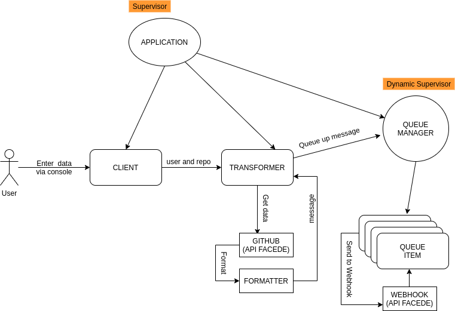

# SWAPCA 
#### (SWAP - Challenge Accepted)

This application help us to retrieve issues registered in any github's public repository and receive it in our webhook nicely formatted.

## Builded with
 - [HTTPoison](https://hexdocs.pm/httpoison/HTTPoison.html)
 - [Poison](https://hexdocs.pm/poison/Poison.html)
 - [Distillery](https://hexdocs.pm/distillery/2.0.0/home.html)

## How it works

## How to run

Via mix:

